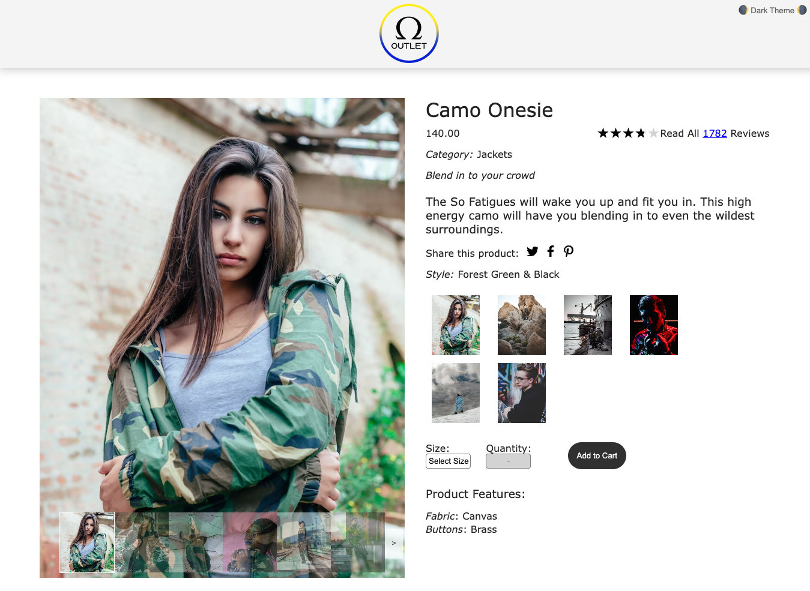
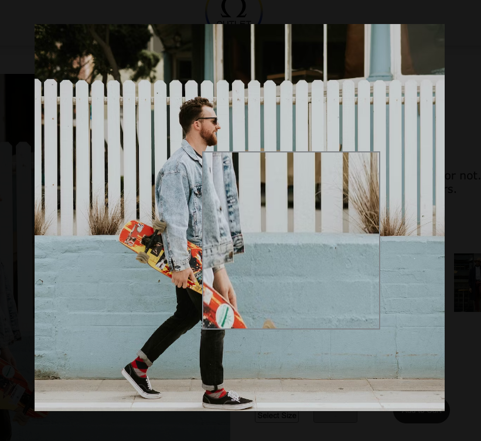
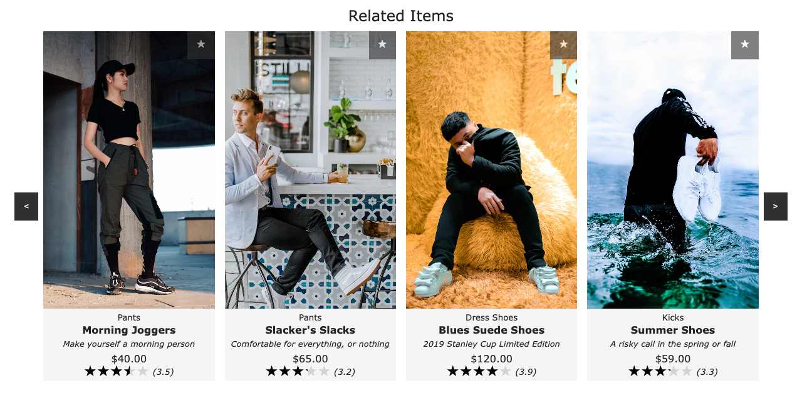
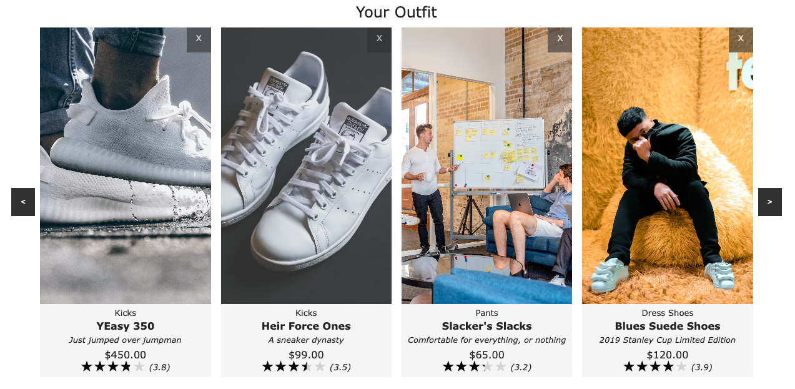
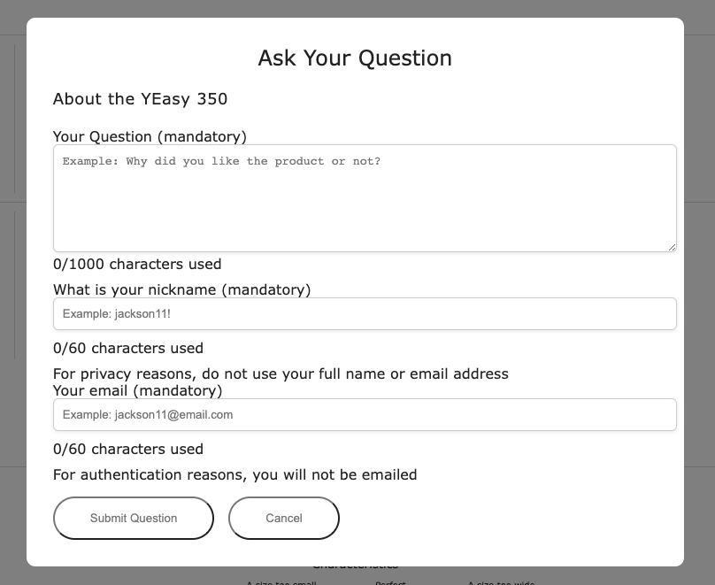
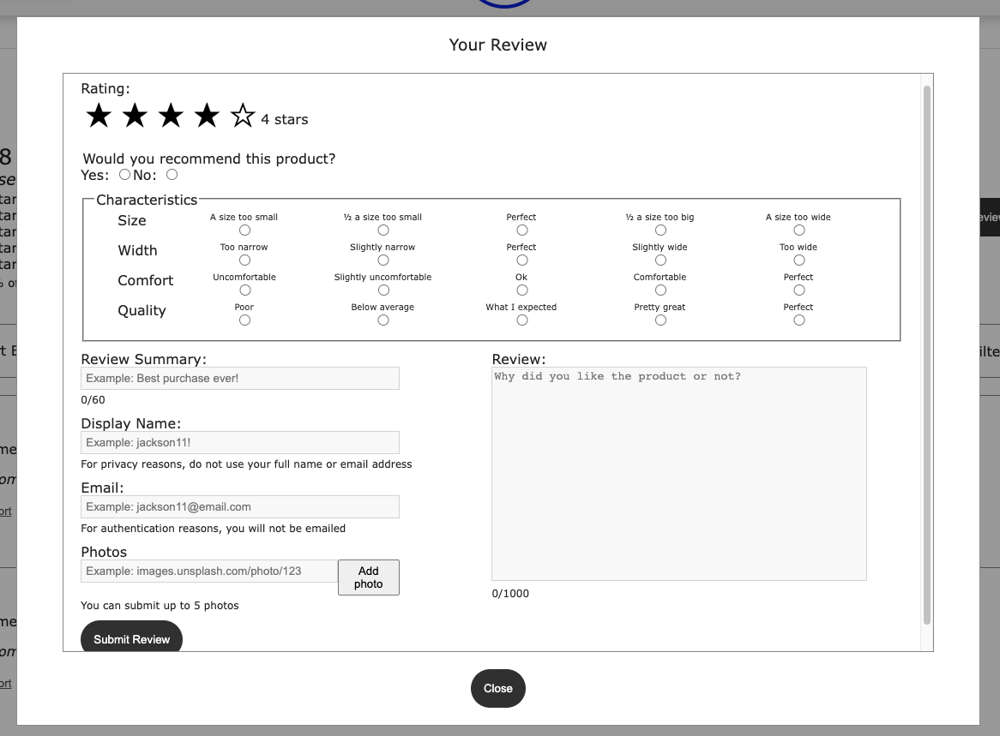

# Omega Outlet

Table of Contents
- [Description](#description)
- [Authors](#authors)
- [Built With](#built-with)
- [Getting Started](#getting-started)
- [Project Overview & Demos](#project-overview--demos)
   - [Overview](#overview)
   - [Related Items & Comparison](#related-items--comparison)
   - [Questions & Answers](#questions--answers)
   - [Ratings & Reviews](#ratings--reviews)

## Description
This project showcases user-centric software engineering through the development of an engaging online retail web application. Each feature was built from the ground up by one of our team's four engineers.

## Authors

- [**Lauren Laxton**](https://github.com/LLaxt)
- [**Kimberly Tom**](https://github.com/tomki1)
- [**Eric Chang**](https://github.com/ESC8504)
- [**Brandon Gomez**](https://github.com/bgomez9212)

## Built With

- 
- 
- 
- 
- 
- 
- 
- 
- 
- 

## Getting Started

1. **Clone the repo**
   `git clone https://github.com/Omega-outlet/FEC.git`

2. **Navigate to project directory**
   `cd your-project-name`

3. **Install necessary dependencies**
   `npm install`

4. **Update example.config.js and example.env**

5. **Run the application**
   `npm run server-dev`
   `npm run server-dev`

## Project Overview & Demos

## Overview
Product Information: This section shows product details, provides social media share buttons, enables the selection of product size and quantity so the user can add the product to the cart, and has clickable thumbnails of each product style that allow the user to change the style.

Image Gallery: This portion contains a main image with different images of the product style below it.  Users can scroll through these images to change the main image.  Clicking on the main image will overlay the image gallery over the rest of the product detail page. The user can click on thumbnails of the product style to change the main image.  Clicking on the main image will zoom the image by 2.5 times.

## Related Items & Comparison
Related Items & Your Outfit: The Related Items & Your Outfit module displays two sets of products. The first set is a list of products, determined internally, that are related to the product currently being viewed. The second is a list, custom created by the user, of products that the user has grouped with the current product into an ‘outfit’. The outfit is stored in the user’s local storage and propagated through browser sessions. Each product card is clickable and redirects the user to that product’s detail page. Clicking on the star icon displays a modal window comparing the features of the current product to the selected product. The horizontal scrolling carousels are built from scratch without the use of pre-built modules.

## Questions & Answers
Q&A: The Questions & Answers module allows users to ask and answer questions for the selected product. The functionalities within this module are divided into several pieces: viewing questions, searching for a question, asking a question, and answering a question. This component enhances the ability to view and search questions, pose queries, provide answers, and offer feedback on questions related to the current product. All interactions, both asking and answering, are specific to each product.

## Ratings & Reviews
Ratings & Reviews: The Ratings & Reviews module allows viewing and submission of reviews for the product selected. This component extends the ability to write, read, and browse through reviews for the current product. All reviews are saved per product. Product breakdowns are also displayed by characteristics and the average rating received for that characteristic. Specific styles are not accounted for within the review module.

